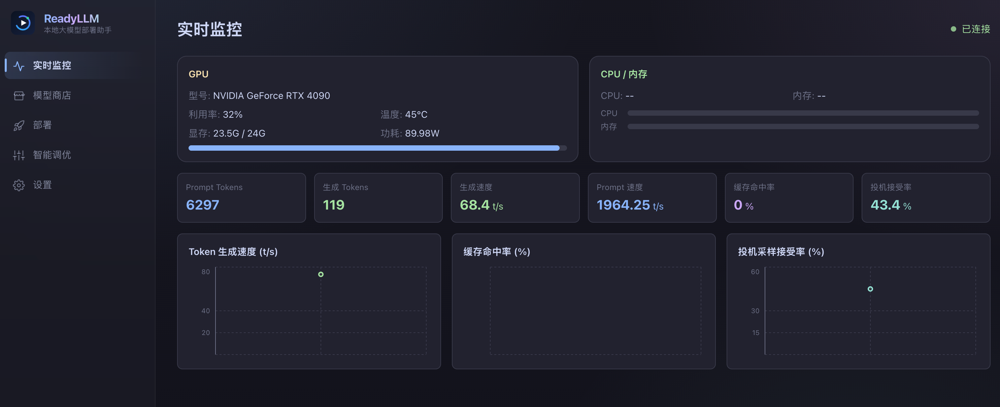
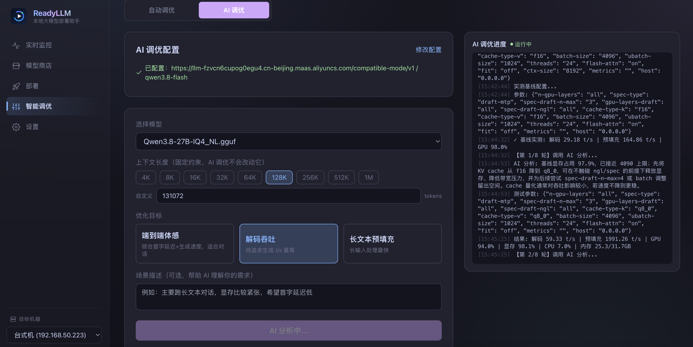
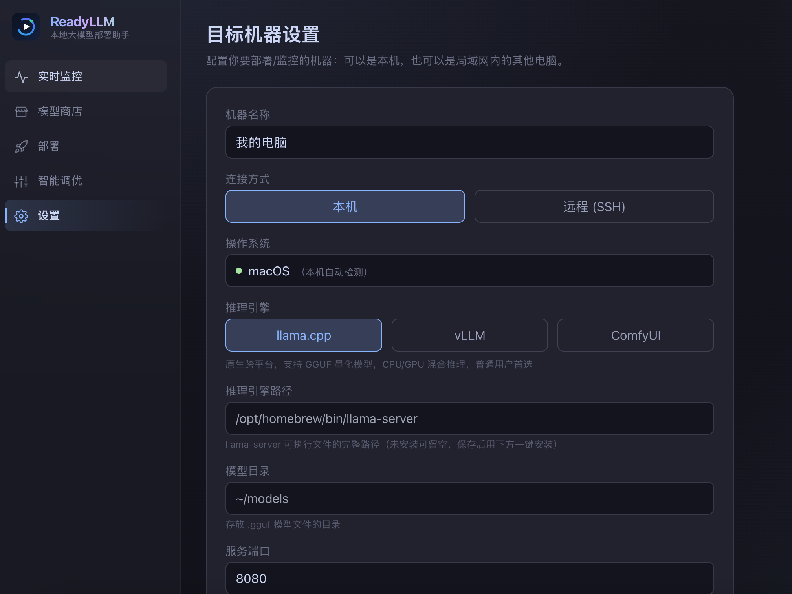

<div align="center">


# ReadyLLM

**A local / LAN LLM deployment, monitoring & tuning assistant**

Deploy, monitor, and tune large language models through a visual interface — plus image / video generation on top of ComfyUI.

[](#requirements)
[](#tech-stack)
[](#tech-stack)
[](#tech-stack)
[](#known-limitations)
[](LICENSE)

**English** · [简体中文](README.zh-CN.md)

</div>

---

**ReadyLLM** is a visual assistant for local and LAN machines. It is not tied to any specific environment — target device, inference engine path, model directory, and port are all configured by you in the UI, and the tool probes hardware, installs engines, launches services, and optimizes parameters against your actual setup. The same interface manages both the local machine and other computers on your network over SSH.

## Preview



> Real-time monitoring: GPU / VRAM / throughput / latency metric curves



> Smart tuning: two-phase parameter search and benchmark results



> Target machine settings: local or remote over SSH, engine and model directory configuration

## Table of Contents

- [Features](#features)
- [Tech Stack](#tech-stack)
- [Architecture](#architecture)
- [Project Structure](#project-structure)
- [Getting Started](#getting-started)
- [Workflow](#workflow)
- [Configuration](#configuration)
- [Known Limitations](#known-limitations)
- [Roadmap](#roadmap)
- [Contributing](#contributing)
- [License](#license)

## Features

- **Unified target management**: add the local machine or remote LAN machines (SSH, key or password), auto-detect the OS, and configure the inference engine and model directory.
- **Hardware detection & model recommendation**: probe the target's GPU / VRAM / CPU / RAM and recommend models that actually fit.
- **Model store**: a curated built-in GGUF catalog, plus dynamic fetching of popular models from HuggingFace; three download sources (hf-mirror, ModelScope, HuggingFace), background downloads with progress, and integrity checks after download.
- **One-click deployment**: start / stop inference services (llama.cpp, vLLM) with manually tweakable runtime parameters; when the engine is missing on the target, install it in one click (auto download / compile / pip and back-fill the path).
- **Real-time monitoring**: push GPU utilization, VRAM, throughput, and latency curves live over WebSocket.
- **Smart tuning**:
  - *Auto tuning*: two-phase parameter search (coarse over high-impact discrete params + fine over continuous params), with VRAM feasibility pre-checks and reliable benchmarking, optimizing for latency / throughput / prefill targets.
  - *AI Agent tuning*: plug in your own LLM API and let the model reason out parameters from hardware / model / scenario, feeding benchmark results back for multi-round iterative optimization.
- **Image / video generation (ComfyUI)**: text-to-video, storyboard generation, long-video per-shot I2V serial generation and stitching, single-image and finished-video AI upscaling, with finished clips previewable directly from the control side.

## Tech Stack

| Layer | Technology |
| --- | --- |
| Backend | Python · FastAPI · Uvicorn · WebSockets · httpx |
| Frontend | React 18 · Vite 5 · Tailwind CSS · Recharts |
| Inference engines | llama.cpp (GGUF) · vLLM (safetensors) · ComfyUI (image / video) |
| Remote execution | SSH (key / password) · SFTP |

## Architecture

```
┌─────────────────────────────────────────────┐
│  Frontend  React + Vite  (dev :3000)         │
│  Monitor / Store / Deploy / Tune / Settings  │
└───────────────────┬─────────────────────────┘
                    │  /api  +  /ws  (Vite proxy)
                    ▼
┌─────────────────────────────────────────────┐
│  Backend  FastAPI  (127.0.0.1:8000)          │
│  target / hardware / deploy / monitor /       │
│  store / tune / ai-tune  — seven routers      │
│  ─────────────────────────────────────────    │
│  services: executor abstraction · engine      │
│  registry · collectors · tuners · model       │
│  catalog · video/upscale pipelines · config   │
└───────────────────┬─────────────────────────┘
                    │  local shell  /  SSH + SFTP
                    ▼
        ┌───────────────────────────┐
        │  Target machine            │
        │  (local or on the LAN)     │
        │  llama-server / vLLM /     │
        │  ComfyUI + model files     │
        └───────────────────────────┘
```

Two core design ideas:

- **Executor abstraction layer**: local runs use the shell, remote runs use SSH, unified behind one interface. Everything operates on the user-configured `Target` — so the same interface manages both the local machine and LAN machines.
- **Engine registry + adapter pattern**: `llama_cpp` / `vllm` / `comfyui` each implement an `EngineAdapter`. Adding an engine only means implementing an adapter and registering one metadata entry, with zero changes to upper layers.

## Project Structure

```
model-deploy-assistant/
├── backend/
│   ├── requirements.txt
│   └── app/
│       ├── main.py            # FastAPI entry, mounts all routers
│       ├── config.py          # HOST / PORT / refresh interval
│       ├── models/target.py   # target config model + persistence
│       ├── api/               # routers: target / hardware / deploy / monitor / store / tune / ai_tune
│       └── services/          # business logic
│           ├── executor.py / ssh_executor.py    # executor abstraction (local / SSH)
│           ├── engine_registry.py / engine_adapter.py
│           ├── llama_cpp.py / vllm.py / comfyui.py   # engine adapters
│           ├── collectors.py            # hardware & monitoring collectors
│           ├── config_generator.py      # deterministic parameter generation
│           ├── tuner.py / ai_tuner.py / tune_history.py   # tuning
│           ├── model_catalog.py / downloader.py           # model catalog & download
│           ├── installer.py             # one-click engine install
│           └── video_*.py / upscale_pipeline.py           # video / long-video / upscale
├── frontend/
│   ├── package.json
│   ├── vite.config.js         # dev port 3000, proxies /api and /ws to 8000
│   └── src/
│       ├── App.jsx            # sidebar nav + page switching
│       ├── pages/             # Monitor / Store / Deploy / Tune / Settings
│       ├── components/        # Icons / Logo / ProgressPanel
│       └── hooks/useWebSocket.js
└── docs/screenshots/          # UI screenshots
```

## Getting Started

### Requirements

- Python 3.9+
- Node.js 18+
- The target machine has (or can install via this tool) the corresponding inference engine: llama.cpp / vLLM / ComfyUI

### 1. Start the backend

```bash
cd backend
python -m venv .venv && source .venv/bin/activate   # Windows: .venv\Scripts\activate
pip install -r requirements.txt
uvicorn app.main:app --host 127.0.0.1 --port 8000
```

The backend listens on `127.0.0.1:8000` by default (see `backend/app/config.py`).

### 2. Start the frontend

```bash
cd frontend
npm install
npm run dev
```

Open `http://localhost:3000`. In dev mode Vite already proxies `/api` and `/ws` to the backend on `8000`, so no extra CORS setup is needed.

### 3. Production build (optional)

```bash
cd frontend && npm run build      # output goes to frontend/dist
```

## Workflow

1. On **Settings**, add a target machine: choose local or remote over SSH, confirm the OS, fill in the engine path and model directory, then click "Test connection" to view hardware info.
2. On **Model Store**, pick and download a model (switch between domestic / overseas sources); after download, return to the list to confirm integrity.
3. On **Deploy**, select a model to start the inference service and adjust runtime parameters as needed; for ComfyUI targets, go to image / video generation.
4. On **Monitor**, watch the live metric curves.
5. On **Tuning**, pick an optimization goal (latency / throughput / prefill) and run auto tuning, or configure your own LLM API to use AI Agent mode for iterative optimization; tuning results can serve as the default deployment parameters.

## Configuration

- **Service binding**: `HOST` / `PORT` / `REFRESH_INTERVAL` in `backend/app/config.py`.
- **Target config persistence**: stored in your home directory at `~/.model-deploy-assistant/targets.json` (outside the project dir, easy to share and back up across projects).
- **AI tuning model API**: on the **Tuning** page, fill in the API URL / key / model name; the key is masked when read back.
- **Adding an inference engine**: implement an `EngineAdapter` subclass under `backend/app/services/`, then register one entry each in the adapter table and engine metadata in `engine_registry.py`.

## Known Limitations

- vLLM does not run natively on Windows; Windows targets must go through WSL2 (the tool shows a guidance prompt).
- ComfyUI on the target listens on its own loopback address by default; when the control side cannot reach its port directly, finished-clip preview is proxied through the backend.
- Model sizes are approximate, used only for display and VRAM filtering; the repository is authoritative.

## Roadmap

- [ ] Multi-engine concurrent scheduling and VRAM allocation
- [ ] Tuning result history comparison and one-click rollback
- [ ] More quantization formats and model sources
- [ ] Package as a desktop application

## Contributing

Issues and pull requests are welcome. Key conventions:

1. Backend is FastAPI, frontend is React + Vite; follow the existing layering (`api` routers / `services` business logic).
2. All features must run on the user-configured `Target` — **never hard-code any specific machine / path / environment**.
3. Add new inference engines via the adapter + registry pattern, keeping upper layers unchanged.
4. Before submitting, make sure both backend and frontend start cleanly and pass a basic smoke test.

## License

Distributed under the MIT License. See [LICENSE](LICENSE) for more information.
