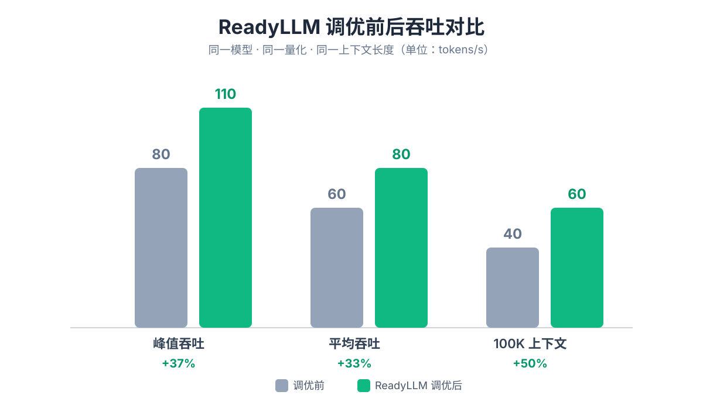

<div align="center">


# ReadyLLM

**让你的本地大模型快 50%——自动调优、AI 调优与实时监控**

可视化完成大模型的部署、实时监控、参数调优，以及基于 ComfyUI 的图像 / 视频生成。

[](#环境要求)
[](#技术栈)
[](#技术栈)
[](#技术栈)
[](#已知约束)
[](LICENSE)

[English](README.md) · **简体中文**

</div>

---

ollama 跑起来的本地模型，生成速度常常只有 10 t/s——CPU 满载，GPU 却只用了 10%。问题不在硬件，而在默认参数没把模型层全塞进显存。手动调参是一场改一个参数、重启、测速、记数字的循环，一晚上改十几版跟瞎蒙差不多。

**ReadyLLM** 把这件事自动化：探测硬件、按显存推荐模型、两阶段自动搜参，还能接入你自己的大模型 API 做 AI 调优，跑完一键「保存并应用」。同一套界面既能管本机，也能通过 SSH 管理局域网里的其他电脑。



> 同一模型、同一量化、同一上下文长度下的实测对比：峰值 +37%、平均 +33%、100K 长上下文 +50%

## 快速上手

```bash
# 1. 后端
cd backend
pip install -r requirements.txt
uvicorn app.main:app --host 127.0.0.1 --port 8000

# 2. 前端
cd frontend
npm install && npm run dev
```

打开 `http://localhost:3000`，添加目标机器，选一个模型，点「智能调优」。
完整配置（venv、生产构建、配置说明）见[快速开始](#快速开始)。

## 界面预览


> 实时监控：GPU / 显存 / 吞吐 / 延迟等指标曲线


> 智能调优：两阶段参数搜索与测速结果


> 目标机器设置：本机或 SSH 远程，引擎与模型目录配置

## 目录

- [核心特性](#核心特性)
- [技术栈](#技术栈)
- [架构](#架构)
- [项目结构](#项目结构)
- [快速开始](#快速开始)
- [使用流程](#使用流程)
- [配置说明](#配置说明)
- [已知约束](#已知约束)
- [路线图](#路线图)
- [贡献](#贡献)
- [许可证](#许可证)

## 核心特性

- **统一管理目标机器**：添加本机或局域网内的远程机器（SSH，支持密钥 / 密码），自动识别操作系统，配置推理引擎与模型目录。
- **硬件检测与模型推荐**：探测目标机的 GPU / 显存 / CPU / 内存，据此推荐能跑得动的模型。
- **模型商店**：内置精选 GGUF 目录，也可从 HuggingFace 动态拉取热门模型；支持 hf-mirror、ModelScope、HuggingFace 三个下载源，后台下载并展示进度，下载后自动校验文件完整性。
- **一键部署**：启动 / 停止推理服务（llama.cpp、vLLM），支持手动微调运行参数；目标机未装引擎时可一键安装（自动下载 / 编译 / pip 并回填路径）。
- **实时监控**：通过 WebSocket 实时推送 GPU 利用率、显存、吞吐、延迟等指标曲线。
- **智能调优**：
  - *自动调优*：两阶段参数搜索（粗搜离散高影响参数 + 细搜连续参数），带显存可行性预检与可信测速，针对延迟 / 吞吐 / 预填充不同目标给出最优配置。
  - *AI Agent 调优*：接入你自己的大模型 API，让 LLM 结合硬件 / 模型 / 场景推理参数，并把测速结果喂回做多轮迭代优化。
- **图像 / 视频生成（ComfyUI）**：文生视频、分镜脚本生成、长视频逐段 I2V 串行生成与拼接、单图与成片 AI 超分，并可在控制端直接预览目标机上的成片。

## 技术栈

| 层 | 技术 |
| --- | --- |
| 后端 | Python · FastAPI · Uvicorn · WebSockets · httpx |
| 前端 | React 18 · Vite 5 · Tailwind CSS · Recharts |
| 推理引擎 | llama.cpp（GGUF）· vLLM（safetensors）· ComfyUI（图像 / 视频） |
| 远程执行 | SSH（密钥 / 密码）· SFTP |

## 架构

```
┌─────────────────────────────────────────────┐
│  前端  React + Vite  (dev :3000)              │
│  监控 / 模型商店 / 部署 / 智能调优 / 设置        │
└───────────────────┬─────────────────────────┘
                    │  /api  +  /ws  (Vite 代理)
                    ▼
┌─────────────────────────────────────────────┐
│  后端  FastAPI  (127.0.0.1:8000)              │
│  target / hardware / deploy / monitor /       │
│  store / tune / ai-tune  七个路由模块          │
│  ─────────────────────────────────────────    │
│  services: 执行器抽象 · 引擎注册表 · 采集器 ·    │
│  调优器 · 模型目录 · 视频/超分管线 · 配置生成器   │
└───────────────────┬─────────────────────────┘
                    │  本地 shell  /  SSH + SFTP
                    ▼
        ┌───────────────────────────┐
        │  目标机器（本机或局域网）     │
        │  llama-server / vLLM /     │
        │  ComfyUI + 模型文件          │
        └───────────────────────────┘
```

两个核心设计：

- **执行器抽象层**：本机走 shell、远程走 SSH，统一成同一个接口，所有功能都基于用户配置的 `Target` 运行——因此同一套界面既能管本机也能管局域网机器。
- **引擎注册表 + 适配器模式**：`llama_cpp` / `vllm` / `comfyui` 各实现一个 `EngineAdapter`，新增引擎只需实现适配器并登记一条元信息，无需改动上层逻辑。

## 项目结构

```
model-deploy-assistant/
├── backend/
│   ├── requirements.txt
│   └── app/
│       ├── main.py            # FastAPI 入口，挂载各路由
│       ├── config.py          # HOST / PORT / 刷新间隔
│       ├── models/target.py   # 目标机配置模型 + 持久化
│       ├── api/               # 路由层：target / hardware / deploy / monitor / store / tune / ai_tune
│       └── services/          # 业务逻辑层
│           ├── executor.py / ssh_executor.py    # 执行器抽象（本机 / SSH）
│           ├── engine_registry.py / engine_adapter.py
│           ├── llama_cpp.py / vllm.py / comfyui.py   # 引擎适配器
│           ├── collectors.py            # 硬件与监控采集
│           ├── config_generator.py      # 确定性参数生成
│           ├── tuner.py / ai_tuner.py / tune_history.py   # 调优
│           ├── model_catalog.py / downloader.py           # 模型目录与下载
│           ├── installer.py             # 引擎一键安装
│           └── video_*.py / upscale_pipeline.py           # 视频 / 长视频 / 超分
├── frontend/
│   ├── package.json
│   ├── vite.config.js         # dev 端口 3000，代理 /api 与 /ws 到 8000
│   └── src/
│       ├── App.jsx            # 侧边导航 + 页面切换
│       ├── pages/             # Monitor / Store / Deploy / Tune / Settings
│       ├── components/        # Icons / Logo / ProgressPanel
│       └── hooks/useWebSocket.js
└── docs/screenshots/          # 界面截图
```

## 快速开始

### 环境要求

- Python 3.9+
- Node.js 18+
- 目标机上已安装（或可通过本工具一键安装）相应推理引擎：llama.cpp / vLLM / ComfyUI

### 1. 启动后端

```bash
cd backend
python -m venv .venv && source .venv/bin/activate   # Windows: .venv\Scripts\activate
pip install -r requirements.txt
uvicorn app.main:app --host 127.0.0.1 --port 8000
```

后端默认监听 `127.0.0.1:8000`（见 `backend/app/config.py`）。

### 2. 启动前端

```bash
cd frontend
npm install
npm run dev
```

打开 `http://localhost:3000`。开发模式下 Vite 已把 `/api` 与 `/ws` 代理到后端 `8000`，无需额外配置跨域。

### 3. 生产构建（可选）

```bash
cd frontend && npm run build      # 产物输出到 frontend/dist
```

## 使用流程

1. **设置**页添加目标机器：选择本机或 SSH 远程，确认操作系统，填写引擎路径与模型目录，点击「测试连接」查看硬件信息。
2. **模型商店**选择并下载模型（按国内 / 境外源切换），下载完成后回到列表确认完整性。
3. **部署**页选择模型启动推理服务，可按需调整运行参数；ComfyUI 目标机则进入图像 / 视频生成。
4. **监控**页查看实时指标曲线。
5. **智能调优**页选择优化目标（延迟 / 吞吐 / 预填充）跑自动调优，或配置你自己的大模型 API 用 AI Agent 模式做迭代优化；调优结果可作为部署的默认参数。

## 配置说明

- **服务监听**：`backend/app/config.py` 中的 `HOST` / `PORT` / `REFRESH_INTERVAL`。
- **目标机配置持久化**：保存在用户主目录 `~/.model-deploy-assistant/targets.json`（不在项目目录内，便于多项目共享与备份）。
- **AI 调优的模型 API**：在「智能调优」页填写 API 地址 / 密钥 / 模型名，密钥读取时做脱敏处理。
- **新增推理引擎**：在 `backend/app/services/` 实现一个 `EngineAdapter` 子类，并在 `engine_registry.py` 的适配器表与引擎元信息中各登记一条即可。

## 已知约束

- vLLM 不支持 Windows 原生运行，Windows 目标机需走 WSL2（工具会给出引导提示）。
- 目标机上的 ComfyUI 默认监听其本机地址，控制端无法直连其端口时，成片预览通过后端代理读取。
- 模型大小仅为近似值，用于展示与显存筛选，实际以仓库为准。

## 路线图

- [ ] 多引擎并发调度与显存分配
- [ ] 调优结果历史对比与一键回滚
- [ ] 更多量化格式与模型来源适配
- [ ] 打包为桌面端应用

## 贡献

欢迎提交 Issue 和 Pull Request。主要约定：

1. 后端为 FastAPI、前端为 React + Vite，遵循现有目录分层（`api` 路由层 / `services` 业务层）。
2. 所有功能须基于用户配置的 `Target` 运行，**严禁硬编码任何特定机器 / 路径 / 环境**。
3. 新增推理引擎请走适配器 + 注册表模式，保持上层逻辑零改动。
4. 提交前请确保前后端均可正常启动并通过基本冒烟测试。

## 许可证

本项目基于 MIT 许可证开源，详见 [LICENSE](LICENSE)。
